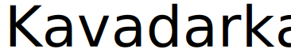

## Кавадарка

Добредојдовте на официјалниот (и веројатно единствен) програмски јазик на кавадаречки дијалект - Кавадарка.

Кавадарка е целосно типуван дијалект на ТајпСкрипт и им овозможува на програмерите од тиквешкиот регион да се изразат на својот мајчин дијалект без препреките на глобализацијата.

## Како да зборуам кавадаречки?

Сетирај проект со ТајпСкрипт и Ролап.

Ако те мрзе клонирај го [стартерот](https://github.com/42dotmk/kavadarka-starter) и почни од таму...

Ако си ееептен ептен мрза, имаш и [СтекБлиц](https://stackblitz.com/~/github.com/42dotmk/kavadarka-starter).

Инсталирај го виа плагин за [Ролап](https://rollupjs.org/):

`npm i -D @42mk/rollup-plugin-kavadarka`

Додај го воа у конфигурацијата, на пример:

```ts
import kavadarka from 'rollup-plugin-kavadarka';

export default {
  input: 'src/index.kk',
  output: {
   file: 'bundle.js',
   format: 'cjs'
  },
  plugins: [
    kavadarka(),
  ]
};
```

???

Мани една ракија и пиши го воа у index.kk:


```
ај низа нека е []

низа.тури(1)
низа.тури(2)
низа.тури(3)

пиши(низа)

за (некој елемент у низа.напрајДаЕ(елемент => елемент * елемент)) {
  пиши(елемент)
}
```

Виа код ќе ти изваде нешто вакво ка ќе се компајлира у ЈаваСкрипт:

```js
'use strict';

var низа = [];
низа.push(1);
низа.push(2);
низа.push(3);
console.log(низа);
for (var _i = 0, _a = низа.map(function (елемент) { return елемент * елемент; }); _i < _a.length; _i++) {
    var елемент = _a[_i];
    console.log(елемент);
}
```

А ако го извршиш ќе вииш нешто вакво:

```ts
[ 1, 2, 3 ]
1
4
9
```

## Демо

ТБД
